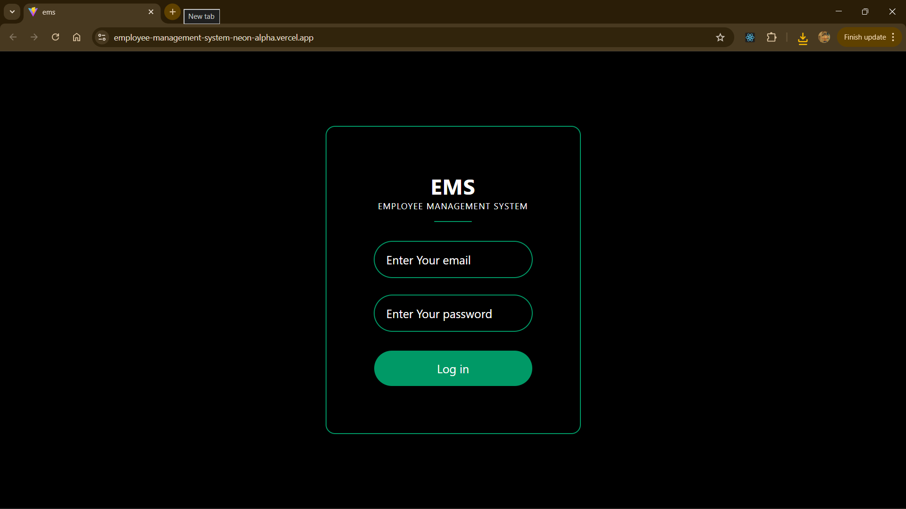
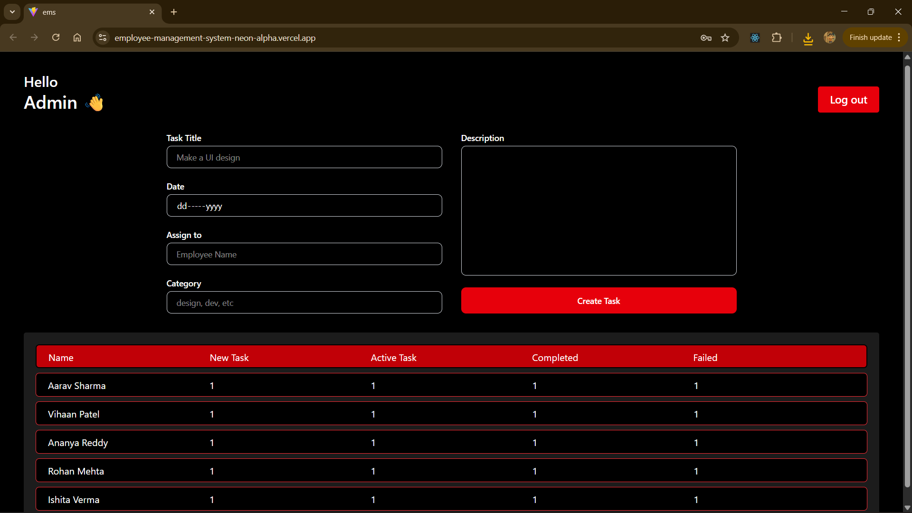
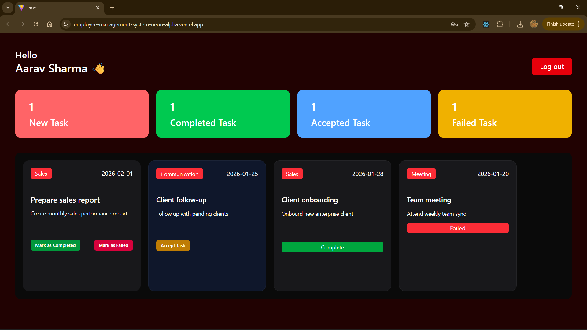

# 🗂️ Employee Task Management System

A **role-based task management web application** built with React.js that allows Admins to assign and track tasks across their team, and Employees to manage and update their own task statuses — all in real time.

🔴 **Live Demo:** [employee-management-system.vercel.app](https://vercel.com/nikkdaws-projects/employee-management-system)  
⭐ If you find this project useful, please consider giving it a star!

---

## 📸 Screenshots

### Login Page


### Admin Dashboard


### Employee Dashboard


---

## ✨ Features

### 👤 Admin
- Secure admin login
- Create and assign tasks to specific employees with title, description, category and due date
- Real-time task overview table showing every employee's task counts across all statuses

### 👨‍💼 Employee
- Secure employee login with session persistence
- Personalized dashboard showing live task statistics (New, Active, Completed, Failed)
- Horizontally scrollable Kanban-style task list
- Accept new tasks, mark active tasks as Completed or Failed

### 🔧 General
- Role-based authentication — Admin and Employee see completely different dashboards
- Session persistence via `localStorage` — stay logged in on page refresh
- Fully responsive UI built with Tailwind CSS

---

## 🛠️ Tech Stack

| Technology | Usage |
|---|---|
| **React.js** | Frontend framework |
| **Context API** | Global state management |
| **localStorage** | Data persistence & session management |
| **Tailwind CSS** | Styling & responsive design |
| **Vite** | Build tool & dev server |
| **Vercel** | Deployment |

---

## 🏗️ Project Structure

```
src/
├── components/
│   ├── Auth/
│   │   └── Login.jsx           # Login page
│   ├── Dashboard/
│   │   ├── AdminDashboard.jsx  # Admin panel
│   │   └── EmployeeDashboard.jsx # Employee panel
│   ├── other/
│   │   ├── Header.jsx          # Top header with logout
│   │   ├── CreateTask.jsx      # Task creation form (Admin)
│   │   ├── AllTask.jsx         # Employee task summary table (Admin)
│   │   └── TaskListNumbers.jsx # Task stats bar (Employee)
│   └── TaskList/
│       ├── TaskList.jsx        # Task card container
│       ├── NewTask.jsx         # New task card
│       ├── AcceptTask.jsx      # Active task card
│       ├── CompleteTask.jsx    # Completed task card
│       └── FailedTask.jsx      # Failed task card
├── context/
│   └── AuthProvider.jsx        # Global auth + data context
├── utils/
│   └── localStorage.jsx        # Seed data & storage helpers
└── App.jsx                     # Root component & routing logic
```

---

## 🚀 Getting Started

### Prerequisites
- Node.js (v18 or above)
- npm or yarn

### Installation

```bash
# 1. Clone the repository
git clone https://github.com/NikkDaw/employee-management-system.git

# 2. Navigate into the project
cd employee-management-system

# 3. Install dependencies
npm install

# 4. Start the development server
npm run dev
```

The app will be running at `http://localhost:5173`

---

## 🔐 Demo Credentials

### Admin
| Field | Value |
|---|---|
| Email | `admin@me.com` |
| Password | `123` |

### Employees
| Name | Email | Password |
|---|---|---|
| Aarav Sharma | `employee1@example.com` | `123` |
| Vihaan Patel | `employee2@example.com` | `123` |
| Ananya Reddy | `employee3@example.com` | `123` |
| Rohan Mehta | `employee4@example.com` | `123` |
| Ishita Verma | `employee5@example.com` | `123` |

---

## 💡 How It Works

### Task Lifecycle
```
Admin creates task → Appears as "New Task" on Employee dashboard
        ↓
Employee clicks "Accept Task" → Status changes to "Active"
        ↓
Employee clicks "Mark as Completed" → Status changes to "Completed"
        OR
Employee clicks "Mark as Failed" → Status changes to "Failed"
```

### State Management Flow
```
AuthProvider (Context)
    ├── Holds employees array + updateEmployees()
    ├── App.jsx derives live employee data on every render
    ├── AdminDashboard reads + writes via context
    └── EmployeeDashboard reads + writes via context
```

Every state update saves to `localStorage` simultaneously, so data survives page refreshes.

---

## 🧠 Key Concepts Demonstrated

- **React Context API** — global state without prop drilling across 12+ components
- **Role-based rendering** — completely different UI based on authenticated user role
- **Derived state pattern** — App derives employee data live from context instead of stale snapshots
- **Immutable state updates** — spread operator used throughout to avoid direct mutation
- **localStorage as data layer** — full CRUD operations persisted to browser storage
- **Component-based architecture** — 12+ reusable, single-responsibility components

---

## 🔮 Future Improvements

- [ ] Add React Router for proper URL-based navigation
- [ ] Replace localStorage with a real backend (Node.js + Express + MongoDB)
- [ ] Add task deadline notifications
- [ ] Add Admin ability to edit or delete tasks
- [ ] Add search and filter on Admin dashboard
- [ ] Add dark/light mode toggle

---

## 👨‍💻 Author

**Nikunj Mahadev Dawari**  
[](https://www.linkedin.com/in/nikunj-dawari)
[](https://github.com/NikkDaw)

---

## 📄 License

This project is open source and available under the [MIT License](LICENSE).
